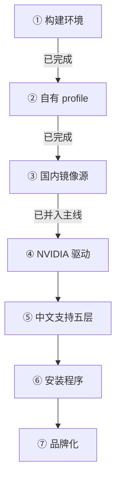

# MipLinux

**一个面向中文用户的 Arch Linux 发行版。**

滚动更新。中文环境是默认配置，不是装完之后的待办事项。

---

## 为什么会有这个项目

Arch Linux 本身很好，但对中文用户来说，从「装完系统」到「系统能用」之间隔着一堆手工活。我们打算这样处理它：

| 装完 Arch 之后，你通常还要 | 我们打算怎么做 | 当前 |
|---|---|---|
| 换国内镜像源，否则下载慢到不可用 | 默认国内源，**并且装完的系统会继承** | 🚧 已并入主线；装后系统的继承待解 |
| 装中文字体，还要手调 `fontconfig` 的 CJK fallback | 字体层默认配好，中英混排不乱字重 | 🚧 规则已落地，字体包待补 |
| 装输入法，处理 Wayland 下的环境变量与自启动 | `fcitx5` + RIME 默认可用 | 🚧 环境变量已就位，包未进清单 |
| 预生成 `zh_CN.UTF-8`、设时区、配键盘 | 本地化层默认到位 | 🚧 配置已并入主线，待装后验证 |
| 自己装 NVIDIA 驱动，还要处理内核绑定 | 安装介质自带 `nvidia-open`，开箱可用 | 未开始 |
| 遇到问题找不到中文资料 | 随系统提供中文上手文档 | 未开始 |

> 这是一份**设计目标**，不是已完成的功能清单。实现进度见 [现状](#现状) 与 [路线图](#路线图)。

**中文支持不是一个包的事。** 网络、字体、输入法、本地化、文档，五层缺一层就是半成品 —— 比如只装了 `fcitx5` 却没配 Wayland 环境变量，输入法就是不会出现；只换了 Live 环境的镜像源，用户装完后第一次 `pacman -Syu` 就会退回官方源。

这个项目要解决的是这些**层与层之间的接缝**。

---

## 现状

> **项目处于早期阶段，尚未对外发布。**
>
> 构建链路已经跑通：[archiso](https://gitlab.archlinux.org/archlinux/archiso) 官方 `releng` profile
> 已搬进项目仓库并定名为 MipLinux，产物是可引导的 `miplinux-*.iso`。
> 中文环境的第一批配置层（国内源、`zh_CN.UTF-8`、CJK fallback 规则、终端）也已并入主线。
>
> 让它真正成为 MipLinux 的其余部分 —— NVIDIA 驱动、字体与输入法**包**、安装程序、品牌化 ——
> **尚未进入主线**。
>
> 本文档描述的是已经定下来的技术决策与实现路径，不是已交付的功能。

| 项目 | 选型 |
|---|---|
| **构建基底** | 官方 `archiso` + `releng` profile |
| **内核** | 官方 `linux` |
| **NVIDIA** | `nvidia-open`，覆盖 Turing 及更新架构 |
| **交付形态** | 装到硬盘的传统发行版，支持 `pacman -Syu` 滚动升级 |
| **构建环境** | `systemd-nspawn` 容器内的纯 Arch |
| **测试环境** | 宿主机 QEMU/KVM |
| **平台** | x86_64 |

---

## 它是怎么造出来的

发行版的「源代码」是一堆配置文件，构建过程是**装配**而不是编译。

| 环境 | 职责 | 为什么不能省 |
|---|---|---|
| **构建** | `systemd-nspawn` 内的纯 Arch | 需要 `pacman` / `pacstrap` / `mkinitcpio`，且不能引入宿主发行版的源 |
| **测试** | 宿主机 QEMU + KVM | `nspawn` 不具备「引导」能力，测不了 ISO |
| **终验** | 真机 | NVIDIA 驱动与畸形分区，QEMU 测不了 |

四条贯穿全局的原则：

1. **产物决定一切** —— 装出来的系统能不能启动，是唯一的验收标准
2. **配置即事实** —— 文档与配置不一致时，以配置为准
3. **Live 与装后系统必须一致** —— 同一份包清单，避免「Live 里能用、装完不能用」
4. **逻辑先于外壳** —— 先把装系统的逻辑跑通，最后才写界面

---

## 技术决策

已定决策记录在案，每条都有实测依据。

| 编号 | 决策 | 理由 |
|---|---|---|
| D1 | 构建基底用官方 `archiso` + `releng` | 不 fork 其它发行版的 Live ISO，避免绑定他人仓库 |
| D2 | 构建必须在纯净 Arch 环境中进行 | 保证构建可复现 |
| D3 | 不使用宿主机 `pacman.conf` 的隐式 `Include` | 否则会静默引入宿主发行版的源 |
| D4 | 内核使用官方 `linux` | `nvidia-open` 硬绑官方内核，可零额外工作拿到预编译模块 |
| D5 | 不挂载任何第三方软件源 | 构建确定性；不依赖其它发行版的仓库 |
| D6 | Live 环境与装后系统共用同一份包清单 | 防止两者行为不一致 |
| D7 | 「可变」指滚动更新 | 交付形态是装机发行版，因此安装器是必需组件，不是可选附件 |
| D8 | NVIDIA 覆盖 Turing 及更新架构 | NVIDIA 590 起主线包切换到 Open Kernel Modules，Pascal 及更老架构已不受支持；两位长期开发者的显卡也在此范围内 |
| D9 | 发行版身份定为 **MipLinux**（`iso_name=miplinux`、卷标 `MIPLINUX_<YYYYMM>`） | 引导项用的是构建时生成的 UUID，不是卷标，所以改名不需要动引导配置 |

完整的推导过程、实测数据与被否决的方案，在项目仓库的 `docs/knowledge/04-架构决策.md`。

---

## 路线图

| 步骤 | 状态 |
|---|---|
| ① 建立 `systemd-nspawn` 构建环境 | ✅ 已完成 |
| ② `releng` profile 搬进仓库，定为 MipLinux 自有 profile | ✅ 已完成 —— 产物 `miplinux-<日期>-x86_64.iso`，1.5 GiB，构建约 2 分钟，默认英文 Live 环境 |
| ③ 替换为国内镜像源，验证构建 | 🚧 已并入主线（Live 环境生效）；**装后系统的继承仍待解决** |
| ④ 加入 NVIDIA 驱动与内核参数 | 未开始 |
| ⑤ 加入中文支持各层 | 🚧 配置层已落地（locale、fontconfig、终端）；字体与输入法的**包**待补 |
| ⑥ 设计并实现安装程序 | 未开始 |
| ⑦ 品牌化 | 未开始 |

> **第 ④ 步必须在真机验证。** 这是整个项目技术风险最高的一点，应当尽早消除 ——
> QEMU 里的虚拟显卡证明不了真机上的驱动可用性。

### 尚未决定的问题

诚实地说，有几件事我们还没想清楚，所以暂时不适合对外承诺：

| 编号 | 待定 |
|---|---|
| P2 | 自用，还是对外发布 |
| P3 | ISO 形态：在线安装，还是离线全量安装 |
| P4 | Live 环境形态：全功能桌面，还是开机直弹安装器 |
| P5 | 桌面环境选型 |
| P6 | 安装程序方案 |
| P9 | 发行版本号制度：产物名沿用构建日期，还是改用语义版本 |

这些问题的候选方案与影响范围，在项目仓库的 `docs/knowledge/06-待定事项.md`。

---

## 为什么会有人需要它

项目的参照系是 [CachyOS](https://cachyos.org/) —— 一个做得很好的 Arch 系发行版，但它对中文用户的短板很明显：中文输入法、字体、国内镜像源、中文本地化都缺默认配置，装完之后仍然是一堆手工活。

MipLinux 把「中文环境」当作一等公民，而不是一个可选的语言包。

---

## 参与

项目目前由**两位长期开发者**维护，一位使用 CachyOS，一位使用 Arch。

如果你对中文 Linux 桌面环境有想法，或者想帮忙测试 NVIDIA 硬件兼容性，欢迎通过 Issue 联系。开始之前请先读 [CONTRIBUTING.md](https://github.com/MipLinux/.github/blob/main/CONTRIBUTING.md)。

发现安全问题请走 [SECURITY.md](https://github.com/MipLinux/.github/blob/main/SECURITY.md) 的流程，不要在公开 Issue 里披露。

---

<b>English</b>

 

**MipLinux** is an Arch Linux-based distribution built for Chinese-speaking users.

Rolling release. The Chinese environment — mirrors, fonts, input method, locale, documentation — ships as the default rather than as post-install chores. A second goal is NVIDIA drivers working out of the box, using `nvidia-open` against the official `linux` kernel with no third-party repositories involved.

**Status:** early stage, no release yet. The build pipeline works end to end — the project's own profile (now named MipLinux) produces a bootable ISO — and the first layers of the Chinese environment (mirrors, `zh_CN.UTF-8`, CJK font fallback rules, console settings) are merged. NVIDIA drivers, font and input-method packages, the installer, and branding are **not implemented yet**.

Built with `mkarchiso` inside a `systemd-nspawn` container running clean Arch; verified by booting in QEMU/KVM. Architecture: x86_64.

