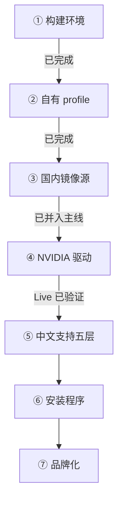

# MipLinux

**一个面向中文用户的 Arch Linux 发行版。**

滚动更新。中文环境是默认配置，不是装完之后的待办事项。

---

## 为什么会有这个项目

Arch Linux 本身很好，但对中文用户来说，从「装完系统」到「系统能用」之间隔着一堆手工活。我们打算这样处理它：

| 装完 Arch 之后，你通常还要 | 我们打算怎么做 | 当前 |
|---|---|---|
| 换国内镜像源，否则下载慢到不可用 | 默认国内源，**并且装完的系统会继承** | ✅ 装后系统的源继承已实测：`mirrorlist` 是继承的国内源、`pacman -Syu` 通过；`reflector` 覆盖防线随 M4 落地（Issue #23） |
| 装中文字体，还要手调 `fontconfig` 的 CJK fallback | 字体层默认配好，中英混排不乱字重 | 🚧 CJK fallback 规则与字体**包**都在 Live 清单里，装后系统的 fallback 规则已实测生效；**装后清单里还没有 CJK 字体包**（P10 阻塞） |
| 装输入法，处理 Wayland 下的环境变量与自启动 | `fcitx5` + RIME 默认可用 | 🚧 环境变量与 `fcitx5` 系的**包**在 Live 清单里，但**没有配置、也没有自启动**；装后清单里还没有（P10 阻塞）—— 两侧都还打不了中文 |
| 预生成 `zh_CN.UTF-8`、设时区、配键盘 | 本地化层默认到位 | ✅ 装后系统的 locale 已实测（`LANG=zh_CN.UTF-8` + `LANGUAGE=`）；时区 / 键盘的控件在原型里已经有了，但键盘目前写死 `us`、只有它生效（Issue #64） |
| 自己装 NVIDIA 驱动，还要处理内核绑定 | 安装介质自带 `nvidia-open`，开箱可用 | 🚧 Live 清单已带 `nvidia-open` / `nvidia-utils`，**真机 Live 已验证**（RTX 5060，见下）；「装完重启后能用」那半段随安装器 M3 一起验 |
| 遇到问题找不到中文资料 | 随系统提供中文上手文档 | ⬜ 未开始（排在发布准备，M5） |

> 这是一份**设计目标**，不是已完成的功能清单。实现进度见 [现状](#现状) 与 [路线图](#路线图)。

**中文支持不是一个包的事。** 网络、字体、输入法、本地化、文档，五层缺一层就是半成品 —— 比如只装了 `fcitx5` 却没配 Wayland 环境变量，输入法就是不会出现；只换了 Live 环境的镜像源，用户装完后第一次 `pacman -Syu` 就会退回官方源。

这个项目要解决的是这些**层与层之间的接缝**。

---

## 现状

> **项目处于早期阶段，尚未对外发布。**
>
> 构建链路已经跑通：[archiso](https://gitlab.archlinux.org/archlinux/archiso) 官方 `releng` profile
> 已搬进项目仓库并定名为 MipLinux，产物是可引导的 `miplinux-*.iso`。
> 装系统链路也通了 —— 安装器的**骨架（M0）**与**无界面逻辑闭环（M1）**都已落地实测，
> 分区 → 装包 → 配置 → 写引导整条链在 QEMU 里能从空盘装出一个能启动的系统，
> 装后系统 `pacman -Syu` 也验过（检查点 4 / 6）。
> **界面（M2）已经有全套原型**：设计语言、流程各页与高级安装都已接线，也在一台真机上跑过一轮；
> 但它**还没接后端**，那一轮跑的是修复前的 ISO —— 修复后的 ISO 待重建。
> Live 侧的中文配置层（国内源、`zh_CN.UTF-8`、CJK fallback 规则、终端）与 NVIDIA 驱动
> （`nvidia-open` / `nvidia-utils`）已并入主线，**驱动有一次真机验证**（RTX 5060，Live 环境）。
>
> 让它真正成为 MipLinux 的其余部分 —— NVIDIA 驱动的**装后系统**半段、字体与输入法的
> **装后清单**、安装器前后端接通、桌面与品牌化 —— **尚未完成**。
>
> 本文档描述的是已经定下来的技术决策与实现路径，不是已交付的功能。

### 进度

**「✅」= 在本机实测过**，不等于用户拿到的成品已经具备该能力。逐日的任务与实测记录在项目仓库的 `docs/work/`；
每一阶段验到第几个检查点，以 `docs/knowledge/05-测试方法.md` 的六个检查点为准。

| 阶段 | 状态 |
|---|---|
| 构建环境与基线 | ✅ 未修改的 `releng` 构建出 ISO，QEMU（UEFI）引导到 `[root@archiso ~]#` |
| 自有 profile | ✅ `profile/` 进仓库并改名 MipLinux，产物 `miplinux-<日期>-x86_64.iso`（1.5 GiB，构建 2 分 08 秒） |
| 装系统链路 | ✅ 安装器 M0 / M1 跑通：QEMU 里不碰键盘直进安装器窗口，窗口没了 tty1 自动交回 `getty`；从空盘装出能启动的系统（检查点 4），装后系统 `pacman -Syu` 成功（检查点 6）。检查点 5 只到配置层 —— 用户 / locale / 字体与输入法的**配置**已实测生效，**包**仍卡 P10 |
| 国内源与中文本地化 | 🚧 已并入主线：国内源、`zh_CN.UTF-8`、CJK fallback 规则、终端字体，字体与输入法包已进 Live 清单；**装后系统的源继承已实测**（`mirrorlist` + `pacman -Syu`）；装后清单缺 CJK 字体与 `fcitx5`（P10） |
| NVIDIA 驱动 | 🚧 Live 清单已带驱动，**真机 Live 第一次验证通过**（RTX 5060 Max-Q，独显模式：驱动加载、`nvidia-smi` 正常、内屏点亮、`nmcli` 联网）；**装完重启后能用未验**，随 M3 走 |
| 安装程序 | 🚧 **M0 完成**（QEMU 开机直进安装器窗口；安装器走了自动把 tty1 交回 `getty` 兜底）、**M1 完成**（无界面逻辑闭环）、**M2 进行中**（全部流程页面与高级安装的 Qt6 原型已接线、每页一屏放得下、流程烟测通过；**前端未接后端**，修复后的 ISO 待重建）。技术栈见 D14 |
| 桌面环境 / 品牌化 | ⬜ 未开始。**P5 已定 WM 路线**（不做 DE），niri / Hyprland 待真机各跑一轮 |

### 选型一览

| 项目 | 选型 |
|---|---|
| **构建基底** | 官方 `archiso` + `releng` profile |
| **内核** | 官方 `linux` |
| **NVIDIA** | `nvidia-open`，覆盖 Turing 及更新架构 |
| **交付形态** | 装到硬盘的传统发行版，支持 `pacman -Syu` 滚动升级 |
| **构建环境** | `systemd-nspawn` 容器内的纯 Arch |
| **测试环境** | 宿主机 QEMU/KVM |
| **平台** | x86_64 |

---

## 它是怎么造出来的

发行版的「源代码」是一堆配置文件，构建过程是**装配**而不是编译。

| 环境 | 职责 | 为什么不能省 |
|---|---|---|
| **构建** | `systemd-nspawn` 内的纯 Arch | 需要 `pacman` / `pacstrap` / `mkinitcpio`，且不能引入宿主发行版的源 |
| **测试** | 宿主机 QEMU + KVM | `nspawn` 不具备「引导」能力，测不了 ISO |
| **终验** | 真机 | NVIDIA 驱动与畸形分区，QEMU 测不了 |

四条贯穿全局的原则：

1. **产物决定一切** —— 装出来的系统能不能启动，是唯一的验收标准
2. **配置即事实** —— 文档与配置不一致时，以配置为准
3. **Live 与装后系统必须一致** —— 同一份包清单，避免「Live 里能用、装完不能用」
4. **逻辑先于外壳** —— 先把装系统的逻辑跑通，最后才写界面

---

## 技术决策

已定决策记录在案，每条都有实测依据。

| 编号 | 决策 | 理由 |
|---|---|---|
| D1 | 构建基底用官方 `archiso` + `releng` | 不 fork 其它发行版的 Live ISO，避免绑定他人仓库 |
| D2 | 构建必须在纯净 Arch 环境中进行 | 保证构建可复现 |
| D3 | 不使用宿主机 `pacman.conf` 的隐式 `Include` | 否则会静默引入宿主发行版的源 |
| D4 | 内核使用官方 `linux` | `nvidia-open` 硬绑官方内核，可零额外工作拿到预编译模块 |
| D5 | 不挂载任何第三方软件源 | 构建确定性；不依赖其它发行版的仓库 |
| D6 | Live 环境与装后系统共用同一份包清单 | 防止两者行为不一致 —— D11 / D12 定案后「共用一份」不再字面成立，怎么重述见 P10 |
| D7 | 「可变」指滚动更新 | 交付形态是装机发行版，因此安装器是必需组件，不是可选附件 |
| D8 | NVIDIA 覆盖 Turing 及更新架构 | NVIDIA 590 起主线包切换到 Open Kernel Modules，Pascal 及更老架构已不受支持；两位长期开发者的显卡也在此范围内 |
| D9 | 发行版身份定为 **MipLinux**（`iso_name=miplinux`、卷标 `MIPLINUX_<YYYYMM>`） | 引导项用的是构建时生成的 UUID，不是卷标，所以改名不需要动引导配置 |
| D10 | 目标范围：**对外发布** | 交付对象是任何下载这份 ISO 的中文用户 —— 签名、发布文档、升级路径、硬件覆盖、缺陷容忍度都按对外标准做 |
| D11 | ISO 形态：**在线安装** —— ISO 只承载 Live 环境，包在安装时从国内源拉取 | ISO 小、迭代快，并把「默认国内源」从加分项变成前提；代价是**安装时必须联网**，Wi-Fi 选择与密码输入因此不能省 |
| D12 | Live 环境：**极简 kiosk**，开机直进安装器 | 路径最短；代价是 Live 不再兼作救援盘。极简 ≠ 什么都不装 —— D11 的联网要求仍由 Live 提供 |
| D13 | 版本号**双轨**：ISO 产物名用构建日期，语义版号（`v0.x.y`）只打在 GitHub Release | 滚动发行版里同一天重建的产物都不同，日期才是产物的真实指纹；语义号只用于对外说明进度 |
| D14 | 安装器技术栈：Python 3 + PySide6/Qt6，Live 用 `cage` 做 kiosk 合成器，分区用 `python-pyparted`，联网用 NetworkManager + `nmcli`，装后系统用 systemd-boot | 选型全部落在官方源，不引入第三方仓库（D5）。v0.1 范围：UEFI + 整盘擦除 + ext4 单根 |

完整的推导过程、实测数据与被否决的方案，在项目仓库的 `docs/knowledge/04-架构决策.md` 与 `06-待定事项.md`。

---

## 路线图

| 步骤 | 状态 |
|---|---|
| ① 建立 `systemd-nspawn` 构建环境 | ✅ 已完成 |
| ② `releng` profile 搬进仓库，定为 MipLinux 自有 profile | ✅ 已完成 —— 产物 `miplinux-<日期>-x86_64.iso`，1.5 GiB，构建约 2 分钟 |
| ③ 替换为国内镜像源，验证构建 | ✅ Live 侧已并入主线；**装后系统的源继承已实测**（`mirrorlist` 为国内源、`pacman -Syu` 通过）；`reflector` 覆盖防线随 M4 落地（Issue #23） |
| ④ 加入 NVIDIA 驱动与内核参数 | 🚧 Live 半段真机验证通过（RTX 5060：驱动加载、`nvidia-smi`、内屏点亮、联网）；**装完重启后能用未验**，随安装器 M3 走 |
| ⑤ 加入中文支持各层 | 🚧 locale / fontconfig / 终端配置与字体、输入法**包**在 Live 清单里，装后系统的 `locale.conf` / `fonts/local.conf` / `/etc/environment` 已实测；**装后清单缺 CJK 字体与 `fcitx5`**，组织方式（P10）未定 |
| ⑥ 设计并实现安装程序 | 🚧 M0（骨架与兜底）与 M1（无界面逻辑闭环，检查点 4 / 6 实测）完成；M2（Qt6 前端）已有全套页面原型与流程接线，**尚未接后端**，修复后的 ISO 待重建；里程碑见项目仓库 `docs/work/installer-roadmap.md` |
| ⑦ 品牌化 | ⬜ 未开始 —— 排在功能之后，且受 P5（桌面）阻塞 |

> **第 ④ 步的第二次验证必须在真机做。** 这是整个项目技术风险最高的一点 ——
> QEMU 里的虚拟显卡证明不了真机上的驱动可用性，而「Live 里能亮」也不等于「装完能用」。

### 尚未决定的问题

诚实地说，有几件事我们还没想清楚，所以暂时不适合对外承诺：

| 编号 | 待定 |
|---|---|
| P5 | 桌面环境选型：**WM 路线已定**（不做完整 DE），niri / Hyprland 二选一 |
| P10 | 包清单的组织方式：**方向已明** —— 两份清单（Live 精简 / 装后更大）+ 安装器询问应用；D6 的「共用一份」怎么重述待定案 |
| P11 | 第三方仓库政策：`archlinuxcn` 现在以 `SigLevel = Optional TrustAll` 启用，对外发布前怎么收紧 |
| P12 | 时区名单与显示名的审定规则：tzdata 的地名本身带政治表述，「列出来的」与「我们写的」是两件事 |

其余曾挂着的问题（发行版名称、目标范围、ISO 形态、Live 形态、安装器方案、版本号制度）都已定案，
结论就是上面 D9–D14 那几条。四个待定项的候选方案与影响范围，
在项目仓库的 `docs/knowledge/06-待定事项.md`。

---

## 为什么会有人需要它

项目的参照系是 [CachyOS](https://cachyos.org/) —— 一个做得很好的 Arch 系发行版，但它对中文用户的短板很明显：中文输入法、字体、国内镜像源、中文本地化都缺默认配置，装完之后仍然是一堆手工活。

MipLinux 把「中文环境」当作一等公民，而不是一个可选的语言包。

---

## 参与

项目目前由**两位长期开发者**维护，一位使用 CachyOS，一位使用 Arch。

如果你对中文 Linux 桌面环境有想法，或者想帮忙测试 NVIDIA 硬件兼容性，欢迎通过 Issue 联系。开始之前请先读 [CONTRIBUTING.md](https://github.com/MipLinux/.github/blob/main/CONTRIBUTING.md)。

发现安全问题请走 [SECURITY.md](https://github.com/MipLinux/.github/blob/main/SECURITY.md) 的流程，不要在公开 Issue 里披露。

---

<b>English</b>

 

**MipLinux** is an Arch Linux-based distribution built for Chinese-speaking users.

Rolling release. The Chinese environment — mirrors, fonts, input method, locale, documentation — ships as the default rather than as post-install chores. A second goal is NVIDIA drivers working out of the box, using `nvidia-open` against the official `linux` kernel with no third-party repositories involved.

**Status:** early stage, no release yet. The build pipeline works end to end — the project's own profile (now named MipLinux) produces a bootable ISO — and the first layers of the Chinese environment (mirrors, `zh_CN.UTF-8`, CJK font fallback rules, console settings) are merged, with the post-install mirror inheritance verified (`pacman -Syu` succeeds) and `nvidia-open` in the live package list verified once on real hardware. The installer's skeleton (M0) and its GUI-less logic core (M1) are implemented and tested — a blank disk installs into a bootable system in QEMU — and its Qt6 interface (M2) now exists as a full prototype with every page of the flow wired up, though it is **not yet connected to the backend** and the ISO containing its latest fixes has yet to be rebuilt. The post-install half of the NVIDIA verification, the CJK-font/input-method packages in the installed system, desktop selection, and branding are **not implemented yet**.

Built with `mkarchiso` inside a `systemd-nspawn` container running clean Arch; verified by booting in QEMU/KVM. Architecture: x86_64.

